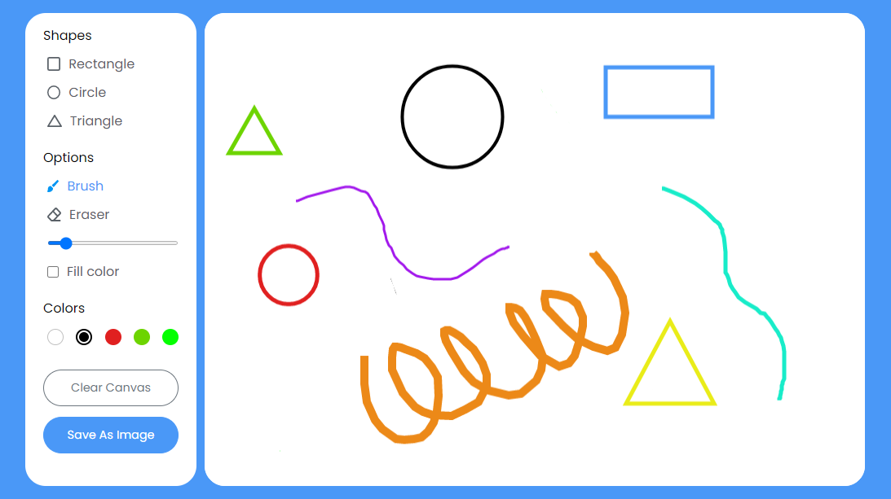

<div align="center">
  
  
  
  
  
  
  
  
  
  
  
  
  
  
  
  
  
  
  

  <h2 align="center">Draw different shapes like rectangles, circles, and triangles in any color, erase or download your drawing as an image and many more options. All these functionalities are done with HTML 5 canvas & vanilla JavaScript, no external framework or library is used</h2>

  Responsive for all devices, built using HTML, CSS, and JavaScript.

  <a href="https://iamjosuefischer.github.io/drawing-app/"><strong>➥ Live Demo</strong></a>

<br />
  
### Demo Screenshot
  
</div>



### Prerequisites

Before you begin, ensure you have met the following requirements:

* [Git](https://git-scm.com/downloads "Download Git") must be installed on your operating system.

### Run Locally

To run **Drawing App** locally, run this command on your git bash or terminal:

Linux and macOS:

```bash
sudo git clone https://github.com/iamjosuefischer/drawing-app.git
```

Windows:

```bash
git clone https://github.com/iamjosuefischer/drawing-app.git
```

### Contact

If you want to contact with me you can reach me at [email](mailto:josuefischercraft@gmail.com).

### License

This project contains an **MIT License**.